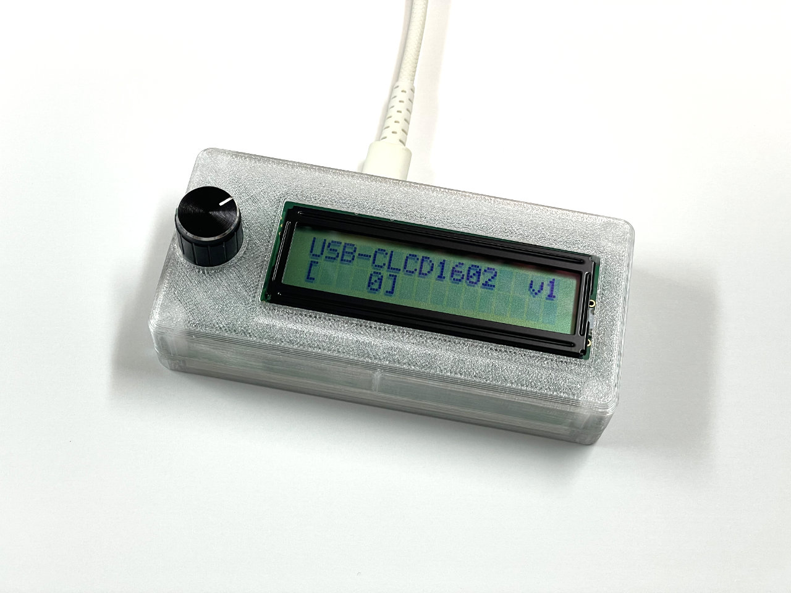
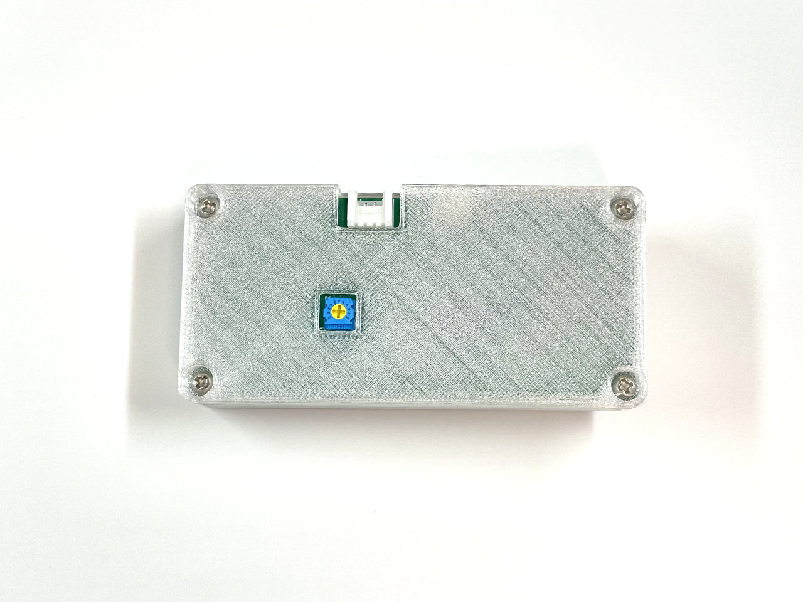
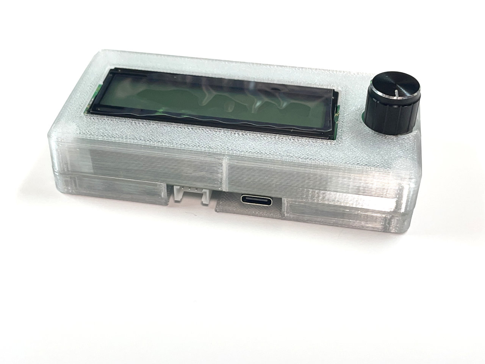

# USB-CLCD1602; convenient I/O interface for PCs and MCUs

USB-CLCD1602は、パソコンやマイコン作品でかんたんに使える便利な入出力モジュールです。文字が大きくシンプルに制御できるキャラクタ液晶と、ちょっとした操作に便利なロータリーエンコーダーが一体となっています。
パソコンとはUSBで、マイコンとはI2Cで接続できます。特殊なデバイスドライバは不要、ライブラリを使用すればかんたんなコードで文字表示や入力読み取りが可能です。

The USB-CLCD1602 is a convenient input/output module that can be easily used in PC and microcontroller projects. It combines a character LCD with large, simple characters and a rotary encoder that is convenient for small operations.
It can be connected to a PC via USB and to a microcontroller via I2C. No special device drivers are required; by using the library, you can display characters and read input with simple code.

## 特徴
- 16文字 2行 キャラクタ液晶（英数字、半角カナ、記号）
- オン・オフ可能なバックライト
- 回転と押し込み操作のできるロータリーエンコーダー（つまみ）
- USBでの制御（USB-HIDクラスで、専用デバイスドライバは不要）
- I2Cでの制御
- 消費電力： 50mA（バックライト消灯）、１５０ｍA（バックライト点灯）

## 応用例
- パソコンのボリューム表示・調整、日付・時刻の表示
- 自作アプリの特別な表示デバイスとして
- Raspberry Piと組み合わせて、動作状態の確認デバイスとして
- ESP32などのWiFiマイコンのIPアドレス表示に

## 各部写真

**背面:**

液晶コントラスト調整用の半固定抵抗があります。

**端子:**

USB Type-C （パソコン向け）と、Grove互換端子（I2C通信向け）があります。

## ご注意
- 液晶のコントラストは背面の半固定抵抗で調整できます。出荷時に調整してありますが、環境によっては再調整が必要になる場合があります。プラスドライバーを使ってゆっくり回してください。
- 単体での動作確認：モバイルバッテリーと本商品をUSBケーブルで接続して、メッセージが表示されるか、つまみを回転して表示が変化するか、ご確認ください。
- 単体では動作するがパソコンと接続しても認識されない場合、USBケーブルがデータ通信できるものを利用しているか、いま一度ご確認ください。
- 販売前の動作確認は行なっていますが、もし動作不良があった場合は、ご購入後1か月以内にお申し出くださいませ。
- 本商品には3Dプリンター製の部品が含まれています。一般的な樹脂製品とは製造方法が異なり、特性も異なります。また、実用上差し支えのない表面の乱れやバリはご容赦ください。また40℃を超える高温環境での利用は変形の可能性があります。

## ファイル構成
- firmware/
    -firmware.ino : USB-CLCD1602のファームウェアのソースコードです。（MCU: CH32V203K8T6）
- examples/
    - app-clock-volume-usbclcd1602/ : Windowsで日時とボリューム表示・調整をする常駐プログラムとライブラリです。
    - arduino_wire_usbclcd1602/ : ArduinoでWireを使って本商品を使うサンプルプログラムとライブラリです。
    - arduino_esp32_usbclcd1602/ : ESP32向けのサンプルプログラムとライブラリです。起動するとWiFiに接続しNTPで時刻を取得、起動後は各情報画面をつまみで切り替えられます。
    - arduino_suzuno32rv_usbhost_usbclcd1602/ : CH32Vマイコンボード Suzuno32RV向けのサンプルプログラムとライブラリです。
- README.md
- 添付ドキュメント_v1.pdf : 頒布のさいに添付しているドキュメントです。
- LICENSE : 各ファイルのライセンスの詳細を記してあります。必ずご確認ください。

